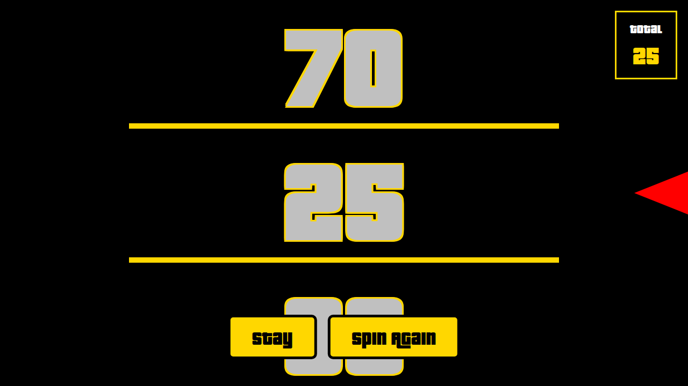

# Price is Right - Big Wheel Spinner



A web-based recreation of the iconic Big Wheel from the TV show "The Price is Right".

## Features

- **Interactive Spinning Wheel** with 20 numbers (15, 80, 35, 60, 20, 40, 75, 55, 95, 50, 85, 30, 65, 10, 45, 70, 25, 90, 5, 100)
- **Seamless Number Wrapping** - Numbers wrap smoothly from 100 back to 15
- **Large, Bold Numbers** - Numbers sized to fill screen width for easy viewing
- **Color-coded Numbers**:
  - 100: Red text with white borders on black background
  - 5 & 15: Dark green text with black borders on light green background
  - All others: Silver text with gold borders on black background
- **Power Gauge** system for controlling spin strength
- **Game Rules**:
  - Up to 2 spins to reach exactly 100 without going over
  - Slow spins (not completing a full rotation) don't count
  - Score of 100 = WIN ("One dollar!")
  - Score over 100 = BUST
  - Can choose to "Stay" after first spin
- **Sound Effects**:
  - Beep as each number passes
  - Ding for final scores under 100
  - Triple ding for winning (100)
  - Buzzer for going over 100
  - Boo sound for slow/invalid spins
- **Progressive Web App (PWA)**:
  - Installable on mobile and desktop
  - Runs with browser UI hidden
  - Works offline with service worker caching
- **Wake Lock** - Keeps screen awake during gameplay

## How to Play

1. Open `index.html` in a web browser or install as a PWA
2. Tap/click anywhere on the screen to start
3. A power gauge will appear - tap/click again to set spin power
4. The wheel will spin and beep as numbers pass
5. After the first spin, choose to "Stay" or "Spin Again"
6. Try to get exactly 100!
7. Click "Play Again" to return to the start screen

### Installing as PWA

On mobile devices:
- **iOS Safari**: Tap the Share button, then "Add to Home Screen"
- **Android Chrome**: Tap the menu (⋮), then "Add to Home Screen" or "Install app"

On desktop:
- **Chrome/Edge**: Click the install icon (⊕) in the address bar
- The app will launch in standalone mode without browser UI

## Technical Details

- Pure HTML5, CSS3, and JavaScript
- Hybrid sound system:
  - Web Audio API for spinner beep sounds (programmatically generated)
  - MP3 sound files (buzzer and ding-ding-ding) from `/sounds` directory for game messages
- Wake Lock API to prevent screen sleep during gameplay
- Service Worker for offline functionality
- Progressive Web App with manifest.json
- Responsive design
- No external dependencies
- Uses the Pricedown font (included in `/pricedown` directory)

## Running Locally

Simply open `index.html` in any modern web browser, or serve it with a local HTTP server:

```bash
python3 -m http.server 8000
# Then visit http://localhost:8000
```

## Browser Compatibility

Works in all modern browsers that support:
- CSS3 animations
- Web Audio API (for spinner beeps)
- HTML5 Audio (MP3 playback for game messages)
- ES6 JavaScript
- Service Workers (for PWA features)
- Wake Lock API (optional, for screen awake feature)

## License

The Pricedown font is subject to its own license (see `pricedown/typodermic-eula-02-2014.pdf`).
